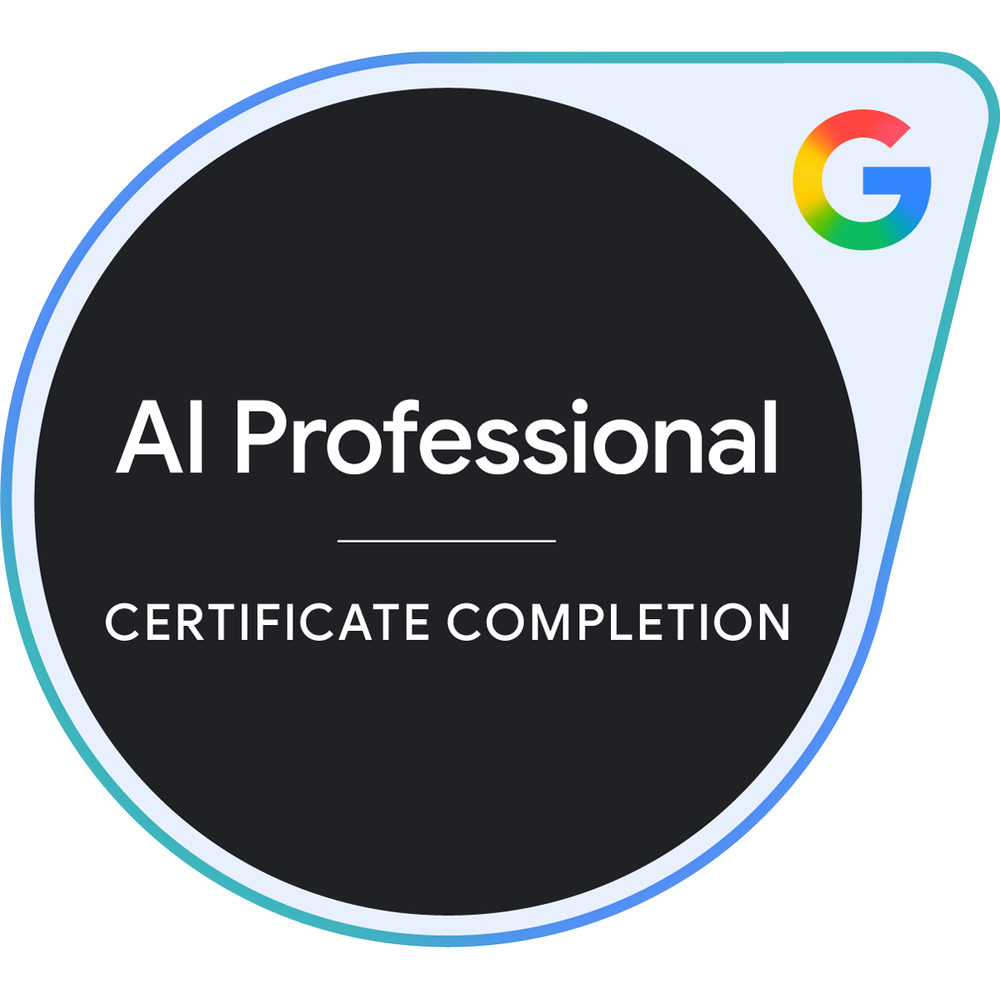
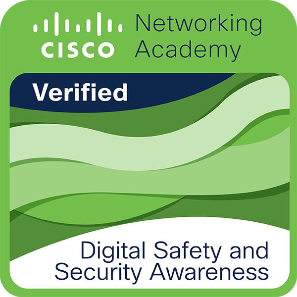
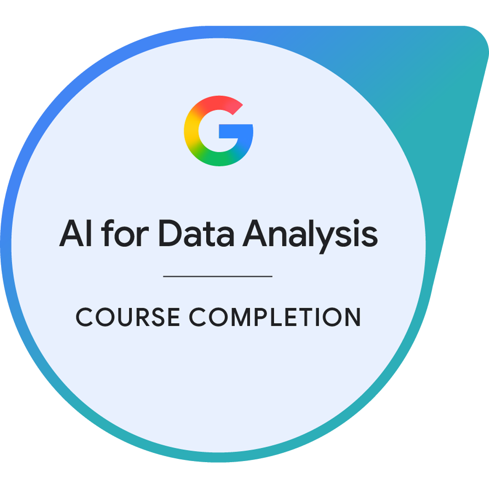
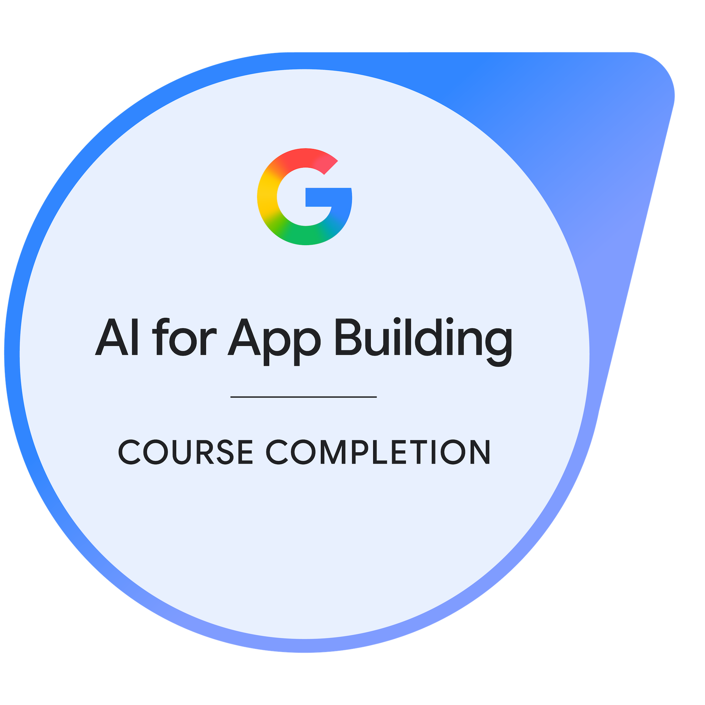

<div align="center">

<pre>
┌──────────────────────────────────────────────────────────┐
│          HOSSOMII / SOFTWARE & SECURITY ENGINEERING      │
│      software × systems × security × visual thinking     │
└──────────────────────────────────────────────────────────┘
</pre>

<h1>Anthony Hossomii Bugs</h1>

<a href="https://git.io/typing-svg">
  
</a>

<br/>

<kbd>SOFTWARE</kbd> <kbd>SYSTEMS</kbd> <kbd>SECURITY</kbd>

<br/><br/>

<a href="https://www.linkedin.com/in/anthony-hossomii-bugs/">
  
</a>
<a href="mailto:anthonysilveira1011@outlook.com">
  
</a>
<a href="https://www.credly.com/users/anthony-da-silveira-bugs">
  
</a>

</div>

---

## `./profile.cs`

```csharp
namespace Hossomii;

public sealed record EngineerProfile(
    string Name,
    string Background,
    string EngineeringBase,
    string CurrentDirection,
    string Focus
);

var anthony = new EngineerProfile(
    Name: "Anthony Hossomii Bugs",
    Background: "Systems Analysis & Development",
    EngineeringBase: "Web, APIs, Databases and Game Systems",
    CurrentDirection: "Security Engineering",
    Focus: "Cloud Security + DevSecOps + AppSec"
);
```

I'm a **Systems Analysis and Development graduate from Brazil**, continuing my academic path in **Software Engineering**.

My background is in software development, working with web applications, APIs, databases and interactive systems using technologies such as **TypeScript, Node.js, C#/.NET, SQL and Git/GitHub**.

I'm currently directing that engineering base toward **Security Engineering**, with a growing focus on systems, networking, Cloud Security, DevSecOps and AppSec.

What interests me most today is understanding not only how software works, but also **how it can fail, how it can be exploited and how those problems can be prevented from the beginning**.

> Build the system. Understand the system. Secure the system.

---

## `cat current-quest.yml`

```yaml
status: building

main_quest:
  base: Software Engineering
  direction: Security Engineering
  specialization:
    - Cloud Security
    - DevSecOps
  complementary:
    - AppSec

recently_completed:
  - Google AI Professional Certificate — Coursera
  - GitHub Foundations Certification — Microsoft
  - Digital Safety and Security Awareness — Cisco Networking Academy / ESCOM

current_training:
  - Security Engineering Foundations

upcoming:
  - Software Engineering — Instituto Infnet

current_foundations:
  - Linux and terminal
  - Computer networking
  - HTTP and web fundamentals
  - Git and GitHub
  - Software development
  - Security fundamentals
  - AI-assisted workflows
  - Responsible AI

next_layers:
  - Python and Bash for automation
  - Windows and PowerShell
  - OWASP and application security
  - Docker and container security
  - GitHub Actions and CI/CD
  - AWS and IAM
  - Terraform and Infrastructure as Code

objective:
  Understand how systems are built, operated and secured.
```

---

## `tree ./skill-set`

<table>
<tr>
<td width="33%" align="center" valign="top">
<h3>Software Engineering</h3>
<p>Engineering foundation</p>
<br/>

<br/><br/>
<sub>
TypeScript · Node.js · C#/.NET<br/>
PostgreSQL · REST APIs · SQL
</sub>
</td>

<td width="33%" align="center" valign="top">
<h3>Web & Product</h3>
<p>Full Stack experience</p>
<br/>

<br/><br/>
<sub>
JavaScript · React · Express<br/>
HTML · CSS · Sass · Vite
</sub>
</td>

<td width="33%" align="center" valign="top">
<h3>Systems & Tooling</h3>
<p>Current expansion</p>
<br/>

<br/><br/>
<sub>
Linux · Git · GitHub<br/>
Terminal · Systems fundamentals
</sub>
</td>
</tr>
</table>

<br/>

<table>
<tr>
<td width="50%" align="center" valign="top">
<h3>Security Direction</h3>
<p>Building depth beyond application code</p>
<br/>
<sub>
Networking · Linux · HTTP<br/>
Security Engineering · AppSec<br/>
Cloud Security · DevSecOps
</sub>
</td>

<td width="50%" align="center" valign="top">
<h3>Creative Systems</h3>
<p>Where the journey started</p>
<br/>

<br/><br/>
<sub>
Unity · C# · Gameplay Systems<br/>
UI · Interactive experiences
</sub>
</td>
</tr>
</table>

---

## `ls ./credentials`

<div align="center">

<kbd>PROFESSIONAL CERTIFICATIONS</kbd>

<br/><br/>

<a href="https://learn.microsoft.com/api/credentials/share/pt-br/AnthonydaSilveiraBugs-9452/37FD992BFF27F121?sharingId=984CB4ED2FC155E1">
  
</a>

<a href="https://www.credly.com/earner/earned/badge/0508fd5a-db3a-4e74-8e18-a6e86bbb7fb9">
  
</a>

<br/><br/>

<sub>
GitHub Foundations · Google AI Professional Certificate
</sub>

<br/><br/><br/>

<kbd>SECURITY CREDENTIALS</kbd>

<br/><br/>

<a href="https://www.credly.com/badges/50e51051-7a7a-49c8-a218-2f062aa3ec77/public_url">
  
</a>

<br/><br/>

<sub>
Digital Safety & Security Awareness · Cisco Networking Academy · ESCOM
</sub>

<br/><br/><br/>

<kbd>APPLIED AI CREDENTIALS</kbd>

<br/><br/>

<a href="https://www.credly.com/earner/earned/badge/9d26a4c9-5d4a-4e72-80a1-f2d7426cc729">
  
</a>

<a href="https://www.credly.com/earner/earned/badge/9ab2d130-fa92-4c80-8e10-5245c995708a">
  
</a>

<a href="https://www.credly.com/earner/earned/badge/712b1ba5-5bc2-4950-bb5b-f9e4b989dd55">
  
</a>

<br/><br/>

<sub>
Data Analysis · AI App Building · AI App Deployment
</sub>

<br/><br/><br/>

<a href="https://www.credly.com/users/anthony-da-silveira-bugs">
  
</a>

<br/><br/>

<sub>
Click any credential to verify it directly with Microsoft or Credly.
</sub>

</div>

---

## `ls ./selected-missions`

<details open>
<summary>
<strong>MISSION 01 — HOSSOMII OS</strong>
</summary>

<br/>

Immersive portfolio inspired by early-2000s operating systems, built as an interactive desktop experience instead of a traditional portfolio page.

```text
TYPE       Interactive Portfolio
STACK      React · TypeScript
CONCEPT    Fictional desktop operating system
FOCUS      Architecture · State · UI systems · Interaction
STATUS     In development
```

The project combines software engineering, interface design and systems-inspired interactions into a single environment.

</details>

<details>
<summary>
<strong>MISSION 02 — Médicos & Dentistas Fullstack</strong>
</summary>

<br/>

Full Stack healthcare platform built around a REST API, real database persistence and frontend/backend integration.

```text
TYPE       Full Stack Application
BACKEND    Node.js · Express · PostgreSQL · Prisma
FRONTEND   React · Sass · Vite
FOCUS      API integration · Data persistence · Responsive UI
```

[**Open repository →**](https://github.com/Hossomii/medicos-dentistas-fullstack)

</details>

<details>
<summary>
<strong>MISSION 03 — TNT Basketball</strong>
</summary>

<br/>

Fast-paced arcade basketball experience developed with Unity and C# for a TNT Energy Drink activation.

```text
TYPE       Interactive Game
ENGINE     Unity
LANGUAGE   C#
FOCUS      Gameplay · Score logic · Power-ups · UI feedback
```

[**Open repository →**](https://github.com/Hossomii/TNT-Basketball)

</details>

---

## `git log --career`

```diff
+ START     Software fundamentals and Systems Analysis & Development
+ BUILD     Unity projects and interactive gameplay experiences
+ EXPAND    Full Stack applications, APIs and relational databases
+ CERTIFY   GitHub Foundations
+ GRADUATE  Systems Analysis & Development
+ CERTIFY   Google AI Professional Certificate
+ CERTIFY   Digital Safety & Security Awareness
+ EVOLVE    Software Engineering as the professional foundation
> FOCUS     Security Engineering, systems and networking
> BUILD     Linux + networking + security foundations
- NEXT      Cloud Security + DevSecOps + AppSec
```

---

## `cat engineering-principles.md`

```text
01. Fundamentals before shortcuts.

02. Understand the system before trying to secure it.

03. Code should be understandable by the next person.

04. Security should be considered before production, not after an incident.

05. Build, test, observe, document and improve.

06. Automation should remove repetition, not understanding.

07. Every project should teach something the previous one did not.
```

---

## `cat security-roadmap.txt`

```text
Software Engineering
        |
        v
Linux + Systems
        |
        v
Networking + HTTP
        |
        v
Security Fundamentals
        |
        +-------------------+
        |                   |
        v                   v
     AppSec              Automation
        |             Python / Bash
        |                   |
        +---------+---------+
                  |
                  v
            Docker + CI/CD
                  |
                  v
             Cloud / AWS
                  |
                  v
                 IAM
                  |
                  v
             Terraform
                  |
                  v
         Security Engineering
                  |
          +-------+-------+
          |               |
          v               v
   Cloud Security      DevSecOps
```

---

## `./github-telemetry`

<details>
<summary>
<strong>Open GitHub statistics</strong>
</summary>

<br/>

<div align="center">

<picture>
  <source
    media="(prefers-color-scheme: dark)"
    srcset="https://github-stats-extended.vercel.app/api?username=Hossomii&amp;show_icons=true&amp;hide_border=true&amp;bg_color=00000000&amp;title_color=E53935&amp;icon_color=E53935&amp;text_color=F0F0F0&amp;ring_color=E53935&amp;include_all_commits=true"
  />
  <source
    media="(prefers-color-scheme: light)"
    srcset="https://github-stats-extended.vercel.app/api?username=Hossomii&amp;show_icons=true&amp;hide_border=true&amp;bg_color=00000000&amp;title_color=B71C1C&amp;icon_color=B71C1C&amp;text_color=24292F&amp;ring_color=B71C1C&amp;include_all_commits=true"
  />
  
</picture>

<picture>
  <source
    media="(prefers-color-scheme: dark)"
    srcset="https://github-stats-extended.vercel.app/api/top-langs/?username=Hossomii&amp;layout=compact&amp;langs_count=6&amp;hide_border=true&amp;bg_color=00000000&amp;title_color=E53935&amp;text_color=F0F0F0"
  />
  <source
    media="(prefers-color-scheme: light)"
    srcset="https://github-stats-extended.vercel.app/api/top-langs/?username=Hossomii&amp;layout=compact&amp;langs_count=6&amp;hide_border=true&amp;bg_color=00000000&amp;title_color=B71C1C&amp;text_color=24292F"
  />
  
</picture>

<br/>

<sub>
Language distribution reflects public repositories, not proficiency.
</sub>

</div>

</details>

---

## `./connect.sh`

```console
anthony@github:~$ ./connect.sh

status     open_to_work
direction  Software Engineering -> Security Engineering
interests  Backend | AppSec | Cloud | DevSecOps | Security
level      Junior | Internship
location   Brazil | Remote
```

<div align="center">

<a href="https://www.linkedin.com/in/anthony-hossomii-bugs/">
  
</a>

<br/><br/>

<pre>
System status: online
Building software. Learning systems. Thinking about security.
</pre>

</div>
