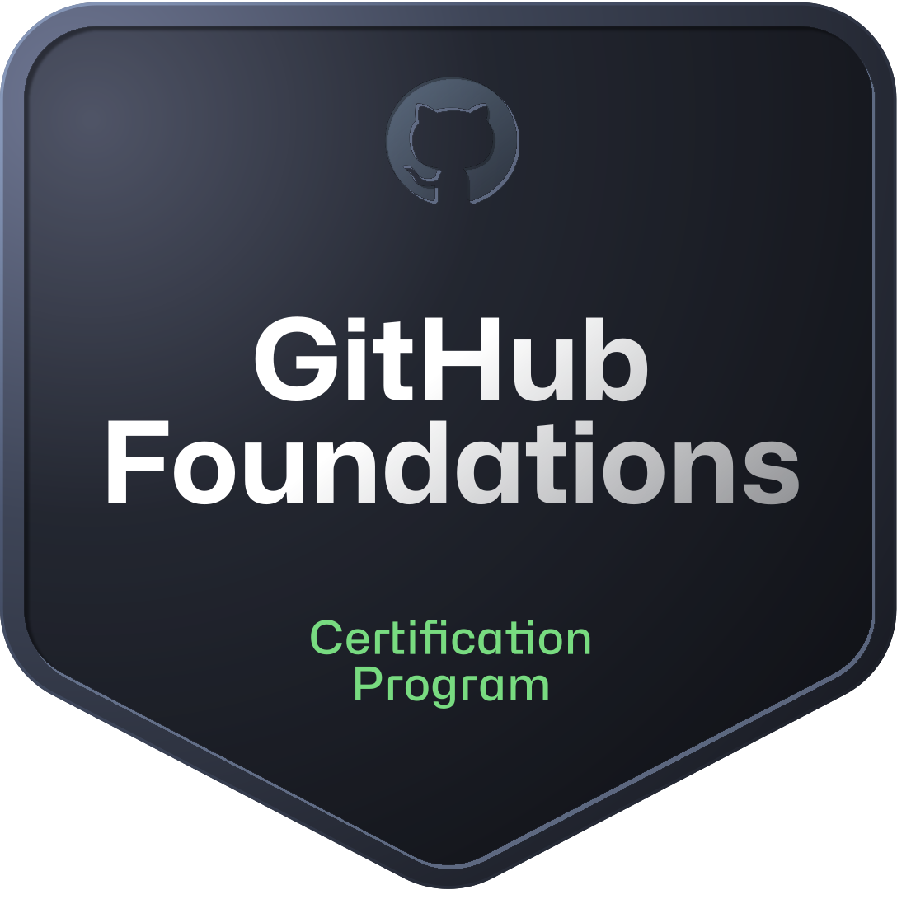

<div align="center">

<pre>
┌──────────────────────────────────────────────────────────┐
│              HOSSOMII / DEVELOPER PROFILE                │
│  backend engineering × game systems × visual thinking    │
└──────────────────────────────────────────────────────────┘
</pre>

<h1>Anthony Hossomii Bugs</h1>

<a href="https://git.io/typing-svg">
  
</a>

<br/>

<kbd>BACKEND</kbd> <kbd>GAMES</kbd> <kbd>DESIGN</kbd>

<br/><br/>

<a href="https://www.linkedin.com/in/anthony-hossomii-bugs/">
  
</a>
<a href="mailto:anthonysilveira1011@outlook.com">
  
</a>

</div>

---

## `./profile.cs`

```csharp
namespace Hossomii;

public sealed record DeveloperProfile(
    string Name,
    string Role,
    string MainStack,
    string Background,
    string CurrentGoal
);

var anthony = new DeveloperProfile(
    Name: "Anthony Hossomii Bugs",
    Role: "Backend Developer",
    MainStack: "C# / .NET",
    Background: "Full Stack + Game Development",
    CurrentGoal: "First professional opportunity in Backend Engineering"
);
```

I'm a **Systems Analysis and Development graduate from Brazil**, currently specializing in Backend Development with **C# and .NET**.

My path started with games and interactive systems, expanded into Full Stack development and now converges on backend engineering. I enjoy building software that is well-structured underneath, intuitive at the point of use and intentional in every detail.

> I came from games, learned through the web and chose backend as the system I want to master.

---

## `cat current-quest.yml`

```yaml
status: building

main_quest:
  role: Backend Developer
  specialization: C# / .NET
  target: Junior or Internship opportunity

current_training:
  - Microsoft Back-End Developer — Coursera
  - Backend .NET — Alura
  - Google AI Professional Certificate — Coursera

focus:
  - C# fundamentals and object-oriented programming
  - ASP.NET Core and REST APIs
  - SQL and relational data modeling
  - Git, debugging and software architecture

objective:
  Build reliable applications without skipping the fundamentals.
```

---

## `tree ./skill-set`

<table>
  <tr>
    <td width="33%" align="center" valign="top">
      <h3>Backend Core</h3>
      <p>Main career path</p>
      <br/>
      
      <br/><br/>
      <sub>
        C# · .NET · PostgreSQL<br/>
        REST APIs · SQL · OOP
      </sub>
    </td>
    <td width="33%" align="center" valign="top">
      <h3>Web Experience</h3>
      <p>Full Stack background</p>
      <br/>
      
      <br/><br/>
      <sub>
        JavaScript · Node.js · Express<br/>
        React · Vite · Sass
      </sub>
    </td>
    <td width="33%" align="center" valign="top">
      <h3>Creative Systems</h3>
      <p>Games and visual thinking</p>
      <br/>
      
      <br/><br/>
      <sub>
        Unity · Gameplay Systems<br/>
        UI · Git · GitHub
      </sub>
    </td>
  </tr>
</table>

---

## `ls ./credentials`

<div align="center">

<a href="https://www.credly.com/badges/d42e99b5-647e-4f87-bb05-ed3ca5a0bf0b/public_url">
  
</a>
<a href="#">
  
</a>
<a href="#">
  
</a>
<a href="https://learn.microsoft.com/pt-br/users/anthonydasilveirabugs-9452/credentials/certification/github-foundations">
  
</a>

<br/><br/>

<sub>
  Verified credentials in Artificial Intelligence, GitHub and software development fundamentals.
</sub>

</div>
---

## `ls ./selected-missions`

<details open>
<summary>
  <strong>MISSION 01 - Médicos & Dentistas Fullstack</strong>
</summary>

<br/>

Full Stack healthcare platform built around a REST API, real database persistence and frontend/backend integration.

```text
TYPE       Full Stack Application
BACKEND    Node.js · Express · PostgreSQL · Prisma
FRONTEND   React · Sass · Vite
FOCUS      API integration · Data persistence · Responsive UI
```

[**Open repository →**](https://github.com/Hossomii/medicos-dentistas-fullstack)

</details>

<details>
<summary>
  <strong>MISSION 02 - TNT Basketball</strong>
</summary>

<br/>

Fast-paced arcade basketball experience developed with Unity and C# for a TNT Energy Drink activation.

```text
TYPE       Interactive Game
ENGINE     Unity
LANGUAGE   C#
FOCUS      Gameplay · Score logic · Power-ups · UI feedback
```

[**Open repository →**](https://github.com/Hossomii/TNT-Basketball)

</details>

---

## `git log --career`

```diff
+ START     Software fundamentals and Systems Analysis & Development
+ BUILD     Unity projects and interactive gameplay experiences
+ EXPAND    Full Stack applications with frontend, APIs and databases
+ GRADUATE  Systems Analysis & Development
> FOCUS     Backend Engineering with C# and .NET
- NEXT      First Junior or Internship opportunity in Backend
```

---

## `cat engineering-principles.md`

```text
01. Fundamentals before shortcuts.

02. Code should be understandable by the next person.

03. Design is part of the product, not decoration.

04. Build, test, document, improve.

05. Every project should teach something the previous one did not.
```

---

## `./github-telemetry`

<details>
<summary>
  <strong>Open GitHub statistics</strong>
</summary>

<br/>

<div align="center">

<picture>
  <source
    media="(prefers-color-scheme: dark)"
    srcset="https://github-stats-extended.vercel.app/api?username=Hossomii&amp;show_icons=true&amp;hide_border=true&amp;bg_color=00000000&amp;title_color=E53935&amp;icon_color=E53935&amp;text_color=F0F0F0&amp;ring_color=E53935&amp;include_all_commits=true"
  />
  <source
    media="(prefers-color-scheme: light)"
    srcset="https://github-stats-extended.vercel.app/api?username=Hossomii&amp;show_icons=true&amp;hide_border=true&amp;bg_color=00000000&amp;title_color=B71C1C&amp;icon_color=B71C1C&amp;text_color=24292F&amp;ring_color=B71C1C&amp;include_all_commits=true"
  />
  
</picture>

<picture>
  <source
    media="(prefers-color-scheme: dark)"
    srcset="https://github-stats-extended.vercel.app/api/top-langs/?username=Hossomii&amp;layout=compact&amp;langs_count=6&amp;hide_border=true&amp;bg_color=00000000&amp;title_color=E53935&amp;text_color=F0F0F0"
  />
  <source
    media="(prefers-color-scheme: light)"
    srcset="https://github-stats-extended.vercel.app/api/top-langs/?username=Hossomii&amp;layout=compact&amp;langs_count=6&amp;hide_border=true&amp;bg_color=00000000&amp;title_color=B71C1C&amp;text_color=24292F"
  />
  
</picture>

<br/>

<sub>
  Language distribution reflects public repositories, not proficiency.
</sub>

</div>

</details>

---

## `./connect.sh`

```console
anthony@github:~$ ./connect.sh

status    open_to_work
roles     Backend Developer | .NET Developer | Software Engineering
level     Junior | Internship
location  Brazil | Remote
```

<div align="center">

<a href="https://www.linkedin.com/in/anthony-hossomii-bugs/">
  
</a>

<br/><br/>

<pre>
System status: online
Thanks for visiting.
</pre>

</div>
